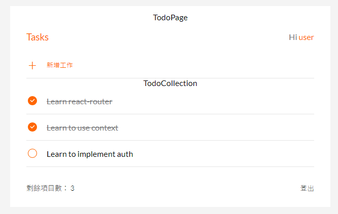

# Todo List X React

使用 React 框架打造的一個 Todo List 網頁，有登入、登出功能，並且可以新增、修改、刪除 list。


## React-router-dom

使用 BrowserRouter、Routes、Route 來設定網頁切換功能。

## CRUD

藉由 todo list 的新增、刪除及修改展示出 CRUD 功能。

## clsx

使用 clsx library 達到利用判斷式更改 classname

## 安裝與下載

下載檔案至本地資料夾

```
git clone https://github.com/fishiryoma/TodoList
```

開啟專案資料夾後安裝檔案

```
npm install
```

輸入執行碼

```
npm run start
```

於瀏覽器輸入以下網址

```
http://localhost:3000/todo
```

## 使用工具與版本

- Node.js v16.20.0
- React v18.2.0
- Clsx v2.1.0
- React-router-dom v6.21.1
- Styled-components v5.3.5
